# Linux 系统脆弱性检查与加固

# 1. 应对登录操作系统的用户进行身份标识和鉴别

## 1.1 使用ssh登录

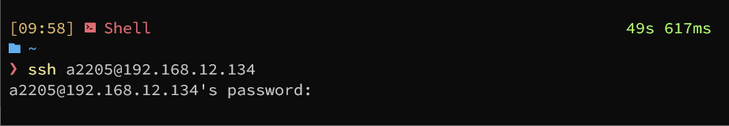

需要输入密码，符号安全标准

## 1.2

查看/etc/passwd和/etc/shadow文件

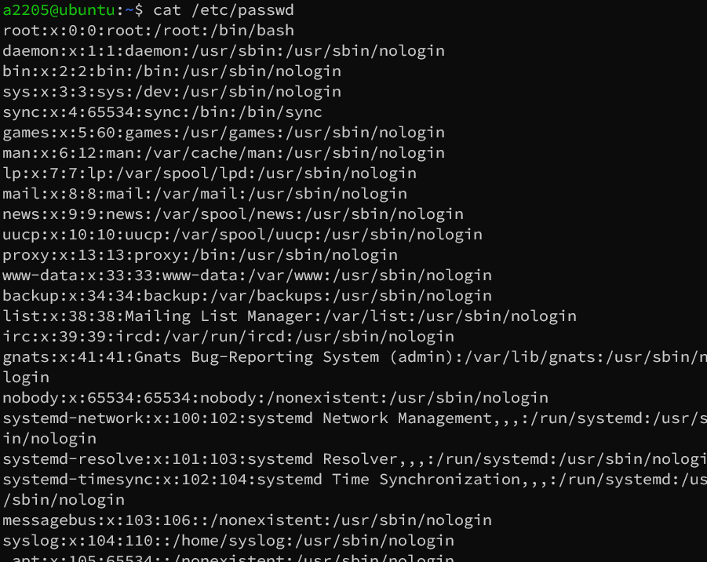

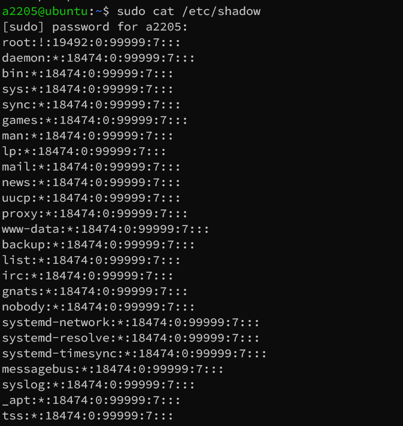

## 1.3 

cat /etc/login.defs查看密码长度和定期更换设置

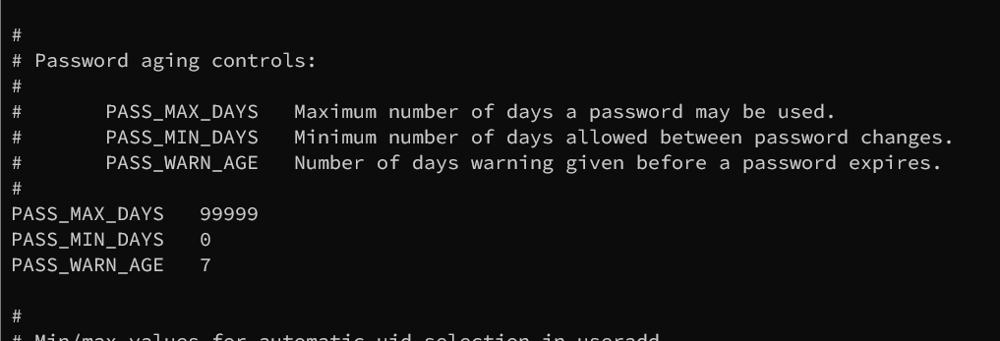

## 1.4

输入命令：“cat /etc/pam.d/system-auth”，查看密码复杂度配置

ubuntu下无此配置

## 2. 登陆失败处理功能

## 2.1

输入命令：“cat /etc/pam.d/system-auth”查看登录失败处理功能是否开启

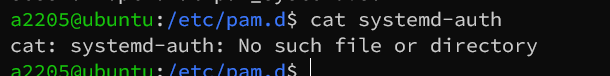

ubuntu无此配置

## 2.2 

输入命令：“cat /etc/profile”，检查超时自动退出功能，若无
TMOUT=300 export TMOUT 俩行内容，则不合规

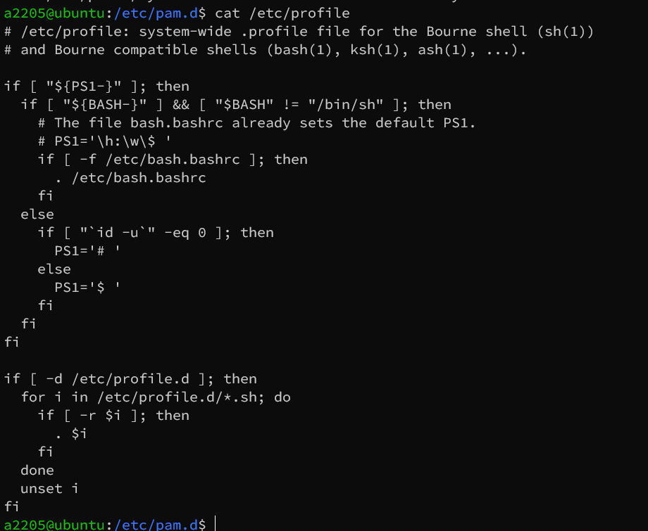

无此内容

# 3.防窃听

## 3.1 

访谈系统管理员，进行远程管理的方式,登录进入操作系统查看是否运行了 sshd 服务：ps -e | grep sshd，查看相关的端口是否打开，netstat -an|grep 22，若使用 ssh 方式进行远程管理，则可以防止鉴别信息在传输过程中被窃听，该项合规

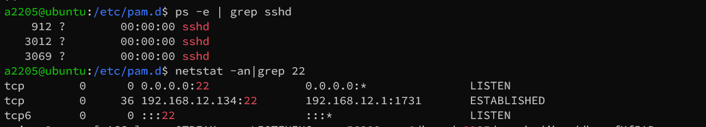

已打开

## 3.2 

则查看是否使用了 Telnet方式进行远程管理，查看 Telnet 服务的状态：systemctl status telnet.socket，若为下图所示则证明不存在 Telnet 服务，则该项合规

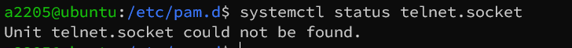

# 4

应对登录的用户分配账户和权限

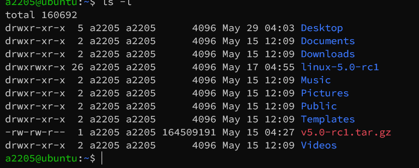

# 5

## 5.1 

步骤 1：输入命令：“sudo more /etc/shadow”查看是否存在默认
的、无用的用户，若存在上述用户则该项不合规

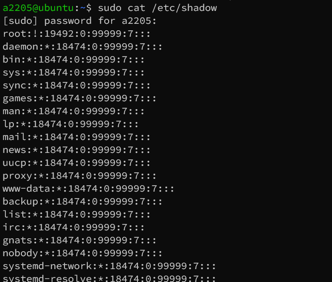

禁止远程登录

sudo vim /etc/ssh/sshd_config

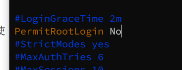

## 5.2

通过以下命令 sudo ls -l /etc/passwd，核查 root 级权限都授予哪些账户，发现只有 root 用户拥有 root 权限，故此项合规

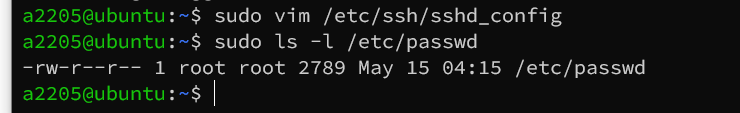

# 6.

## 6.1 

输入查看系统日志服务命令:service rsyslog status 看到系统日志默认为开启,该项合规

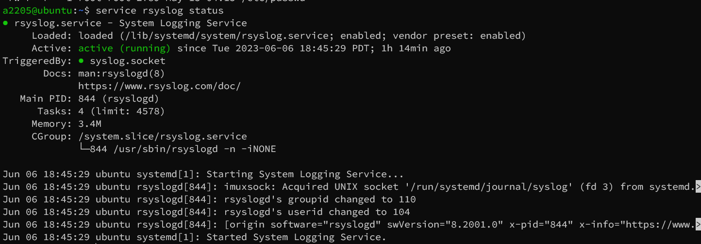

## 6.2

输入命令：service auditd status，发现未开启,该项不合
规

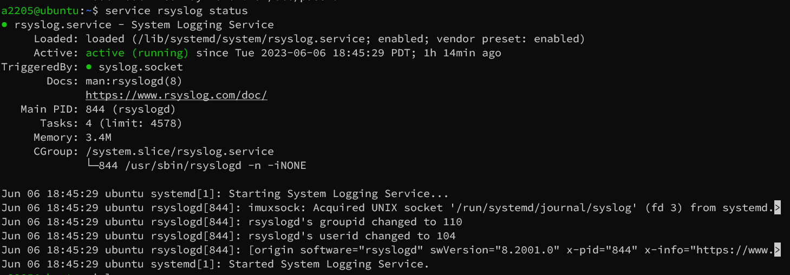

# 7.

## 7.1 

以有相应权限的身份登录进入操作系统,使用命令”sudo ausearch -ts today”

## 7.2 

使用命令” systemctl | grep running “ 查看当前正在
运行的服务，若存在不需要的系统服务或恶意服务，则该项不合规

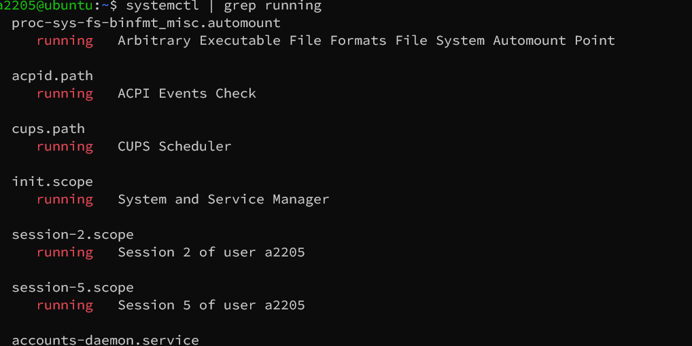

## 7.3

